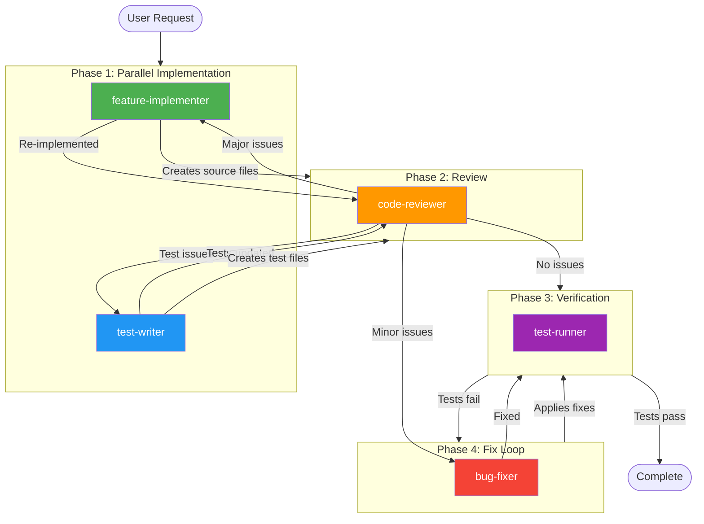

# Feature Implementation Workflow

Use this workflow when implementing new features. Reference this document to orchestrate agents correctly.

---

## Quick Reference

```
User Request → feature-implementer + test-writer (parallel) → code-reviewer → test-runner → [bug-fixer loop if needed] → Complete
```

---

## Workflow Diagram



---

## Phase Instructions

### Phase 1: Parallel Implementation

Launch **both agents simultaneously** in a single message:

```
┌─────────────────────────────────────────────────────────────┐
│  feature-implementer              test-writer               │
│  ─────────────────────            ───────────               │
│  • Source files                   • Test fixtures           │
│  • Business logic                 • Unit tests              │
│  • Type definitions               • Integration tests       │
│  • API methods                    • Snapshot tests          │
└─────────────────────────────────────────────────────────────┘
```

**Why parallel?** These agents have no dependencies on each other. Both work from the same specification.

### Phase 2: Code Review

After both Phase 1 agents complete, launch:

```
┌─────────────────────────────────────────────────────────────┐
│  code-reviewer                                              │
│  ─────────────                                              │
│  • Architecture compliance                                  │
│  • Code quality                                             │
│  • Security review                                          │
│  • Best practices                                           │
└─────────────────────────────────────────────────────────────┘
```

**If issues are found, route based on severity:**

| Issue Type | Route To | Examples |
|------------|----------|----------|
| **Minor fixes** | `bug-fixer` | Import type, unused vars, typos, missing null checks |
| **Major issues** | `feature-implementer` | Wrong architecture, missing functionality, wrong patterns |
| **Test issues** | `test-writer` | Missing test cases, wrong assertions, fixture problems |

### Phase 3: Verification

Run tests to verify implementation:

```
┌─────────────────────────────────────────────────────────────┐
│  test-runner                                                │
│  ───────────                                                │
│  • Unit tests                                               │
│  • TypeScript compilation                                   │
│  • ESLint checks                                            │
└─────────────────────────────────────────────────────────────┘
```

### Phase 4: Fix Loop (if needed)

If tests fail, enter the fix loop:

```
┌─────────────────────────────────────────────────────────────┐
│  bug-fixer → test-runner → [repeat until pass]             │
│  ─────────                                                  │
│  • Analyze error messages                                   │
│  • Identify root cause                                      │
│  • Apply minimal fix                                        │
│  • Re-run tests                                             │
└─────────────────────────────────────────────────────────────┘
```

---

## Agent Reference

| Agent | Model | When to Use |
|-------|-------|-------------|
| `feature-implementer` | sonnet | Writing new code in `src/` |
| `test-writer` | sonnet | Creating test files |
| `code-reviewer` | sonnet | Reviewing completed code |
| `test-runner` | haiku | Running tests and checks |
| `bug-fixer` | haiku | Fixing test failures |

---

## Checklist

Before marking feature complete:

- [ ] All source files created/modified
- [ ] All test files created
- [ ] Code review passed (no critical issues)
- [ ] TypeScript compilation passes
- [ ] ESLint passes
- [ ] All tests pass
